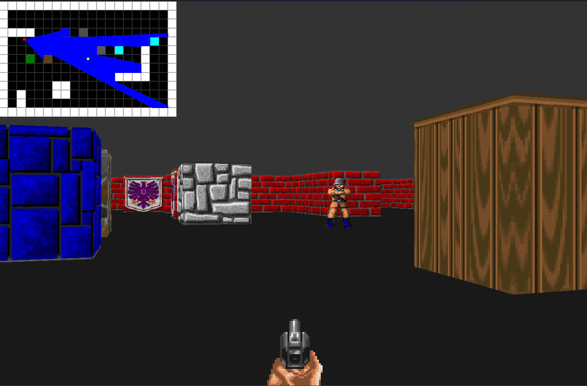
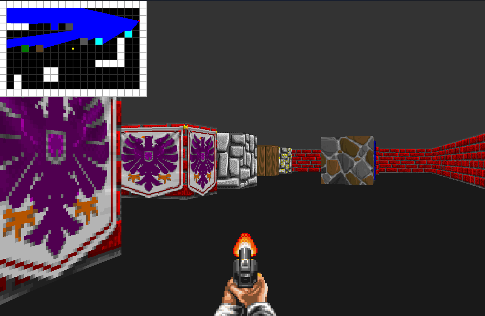

# 🎮 Wolfenstein 3D Clone (Raycasting from Scratch)

This is a personal project where I implement a **Wolfenstein 3D-style game** from scratch using **C++17** and **SDL3**, without relying on any pre-built game engine.

---

## 🚀 Project Goals
- Understand how **raycasting** works internally.  
- Learn how a **framebuffer** is created and rendered.  
- Implement a minimal **software rendering pipeline**.  
- Practice **game loop** structure and **input handling**.  

---

## 🛠️ Tech Stack
- C++17  
- SDL3  
- stb_image (for image loading)  

---

## 📸 Screenshots
Here are some previews of the project in action:

  
  

---

## 📚 Related
This project is part of my journey through **retro game programming** and learning computer graphics fundamentals.  
I also created a course explaining everything step by step — from scratch to a working Wolfenstein 3D clone.  

👉 Check it out here: [Course Link](https://github.com/)  

---
